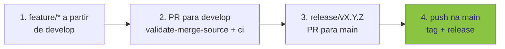
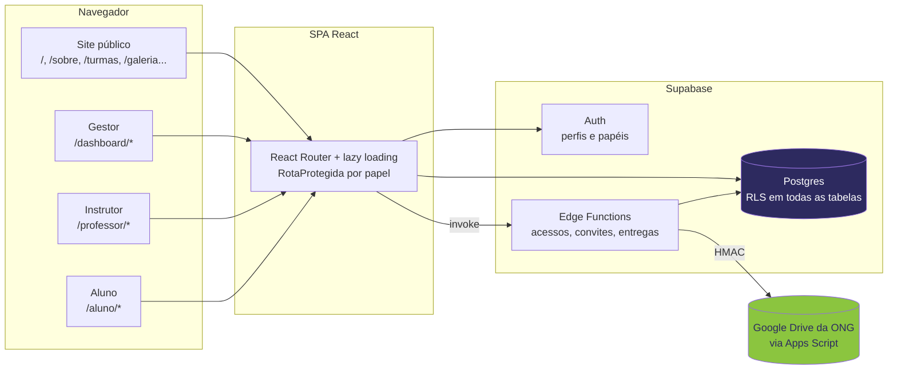
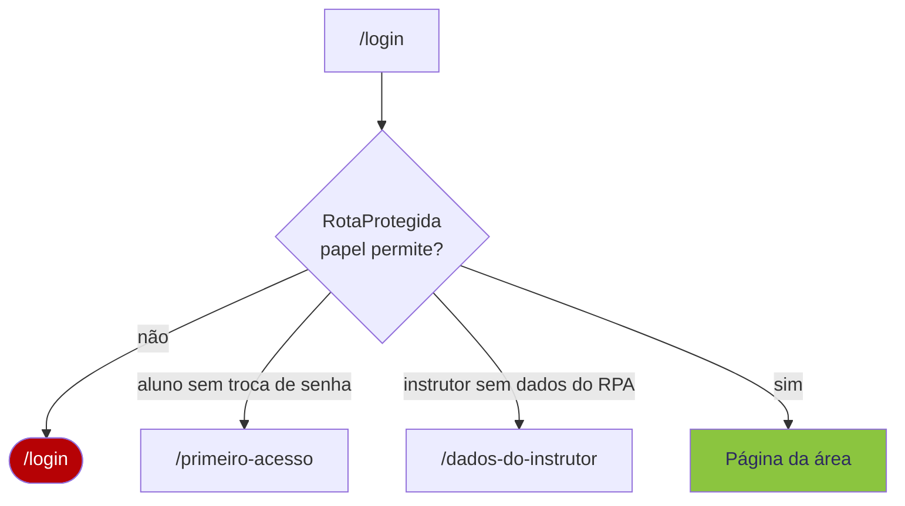
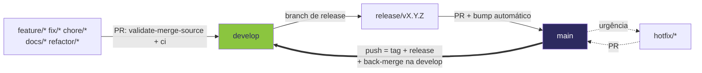

<div align="center">

<picture>
  <source media="(prefers-color-scheme: dark)" srcset="public/imgs/logo/logo.png">
  
</picture>

# FavelaWare_WebSite

**Site oficial e portal do FavelaWare, formação de jovens programadores das comunidades de Belo Horizonte.**

React + TypeScript + Vite no front, Supabase (Postgres, Auth, Edge Functions) atrás.<br/>
Três áreas restritas: gestor, instrutor e aluno.

[](CHANGELOG.md)
[](#stack)
[](#stack)
[](#sobre-o-projeto)

[Sobre](#sobre-o-projeto) · [Arquitetura](#arquitetura) · [Stack](#stack) · [Rodar](#rodar-localmente) ·
[Portal](#portal) · [Banco](#banco-de-dados) · [Git-flow](#git-flow) · [Problemas comuns](#problemas-comuns) ·
[Contribuir](#contribuir)

</div>

---

```bash
npm install                      # 1. dependências
cp .env.example .env.local       # 2. VITE_SUPABASE_URL e VITE_SUPABASE_PUBLISHABLE_KEY
npm run dev                      # 3. localhost:5173
```



## Sobre o projeto

O FavelaWare forma jovens de 15 a 24 anos vindos de comunidades de Belo Horizonte/MG em lógica,
low code, back end e front end, com desenvolvimento pessoal e trabalho em equipe. Iniciativa da
Mundiale, do Ecossistema Ânima Educação (UNA Cristiano Machado) e das Obras Pavonianas com a Rede
Transformar.

Um repositório, duas superfícies: o **site público**, que conta a história das edições, e o
**portal**, onde gestores, instrutores e alunos acompanham turmas, chamada, trilhas e entregas.

## Arquitetura



A `RotaProtegida` só organiza a navegação. Quem protege os dados são as regras RLS do banco.

## Stack

| Camada | Tecnologia | Para quê |
| --- | --- | --- |
| UI | React 19 + TypeScript 5 | framework e tipagem em todo o código |
| Build | Vite 7 | servidor de desenvolvimento e build |
| Estilo | Tailwind CSS 3.4 | tokens de cor `favela-*` em `tailwind.config.js` |
| Animação | Framer Motion 12 | entradas, hover e transições |
| Rotas | `react-router-dom` 7 | SPA com lazy loading |
| Gráficos | Recharts 3 | visão geral do gestor |
| Backend | Supabase: Postgres, Auth, Edge Functions | dados, identidade, convites |
| Arquivos | Google Apps Script + Drive | entregas dos alunos |

```
src/
├── pages/             # controladores: páginas públicas + admin/, professor/, aluno/, equipe/
├── components/        # interface reutilizável (admin/, atividades/, trilhas/)
├── lib/               # serviços por assunto: classe + instância (servicoSessao, servicoPonto...)
├── hooks/             # hooks que ligam a interface aos serviços
├── utils/             # funções usadas por 2+ módulos (datas, texto, preferências)
├── data/              # conteúdo do site: trilhas, turmas, galeria, parceiros, sobre
├── config.ts          # configuração (.env.local e nomes fixos do Supabase)
├── types.ts           # status padronizado e tipos compartilhados
└── App.tsx            # rotas
supabase/
├── migrations/        # schema, RLS e funções
├── functions/         # acessos-alunos, convidar-professor, entregas-drive (+ _shared)
└── testes/            # testes das regras RLS
google-apps-script/    # ponte portal → Google Drive
scripts/               # importação de planilhas e otimização de imagens
```

### Identidade visual

| Token | Cor | Uso |
| --- | --- | --- |
| `favela-green-500` | `#8bc53f` | cor principal, a do logo |
| roxo institucional | `#2d2a5f` | navbar, cabeçalhos, `theme-color` |
| `favela-blue` | `#3b82f6` | apoio |
| `favela-pink` | `#ec4899` | destaques |

Regras de UI na skill `.claude/skills/favelaware-padrao-visual/`.

## Rodar localmente

| Requisito | Versão |
| --- | --- |
| Node.js | 20 ou mais novo (CI usa 22) |
| Projeto Supabase | URL + chave publicável no `.env.local` |

| Comando | O que faz |
| --- | --- |
| `npm run dev` | servidor de desenvolvimento em `localhost:5173` |
| `npm run build` | build de produção em `dist/` |
| `npm run preview` | serve o build localmente |
| `npm run lint` / `lint:fix` | ESLint |
| `npm run typecheck` | TypeScript sem emitir arquivos |
| `npm run format` / `format:check` | Prettier em `src/` |
| `npm test` | testes (Vitest) |

## Portal

| Área | Rota | Papel | O que tem |
| --- | --- | --- | --- |
| Gestor | `/dashboard` | `gestor` | visão geral, alunos, chamada, turmas, equipe, membros, solicitações, avaliações, ponto dos instrutores, trilhas |
| Parceiro | `/dashboard` | `parceiro` | só leitura: visão geral, alunos e chamada |
| Instrutor | `/professor` | `professor` | chamada, ponto, trilhas e, no prazo liberado, a avaliação final da turma |
| Banca avaliadora | `/banca` | `banca` | só a avaliação do dia da banca (entra pelo link do e-mail, sem senha) |
| Aluno | `/aluno` | `aluno` | trilhas, atividades e solicitações |
| Todos | `/perfil` de cada área | qualquer | dados pessoais |

Parceiro novo: convite pelo painel do Supabase (Authentication > Invite user) e, no SQL Editor,
`update public.perfis set papel = 'parceiro', nome = '...', email = '...' where id = (select id from auth.users where email = '...');`.



| Edge Function | Quem chama | Faz |
| --- | --- | --- |
| `acessos-alunos` | gestor | cria ou redefine o acesso dos alunos |
| `convidar-professor` | gestor | convida o instrutor (e liga às turmas) ou o membro da banca por e-mail |
| `entregas-drive` | aluno e instrutor | envia e lê entregas no Drive da ONG |

## Banco de dados

Todas as tabelas com RLS, testadas em `supabase/testes/`.

| Tabelas | Guardam |
| --- | --- |
| `perfis` | identidade, papel, redes, vínculo e cargo |
| `hall_da_fama` | retrato da equipe de cada edição encerrada (lido só por `hall_da_fama_do_site`) |
| `avaliacoes_instrutor`, `membros_banca`, `notas_banca` | avaliação final da edição e banca avaliadora |
| `edicoes`, `turmas`, `participantes`, `duplas` | edições, turmas e alunos |
| `aulas`, `presencas`, `mudancas_horario` | cronograma e chamada (`mudancas_horario` é histórico de 2022, sem tela) |
| `professores_turmas`, `pontos_professores`, `dados_instrutores` | instrutores, ponto e dados do RPA |
| `trilhas`, `conteudos`, `conteudos_turma`, `materiais` | trilhas e material |
| `atividades`, `tentativas`, `arquivos_entrega` | atividades e entregas |
| `solicitacoes`, `mensagens_solicitacao` | pedidos dos alunos e a conversa com a coordenação |

## Git-flow



| Peça | O que faz |
| --- | --- |
| `validate-merge-source` | `main` só aceita `release/*` ou `hotfix/*`; título do PR em Conventional Commits |
| `ci` | gitleaks no histórico, ESLint, TypeScript, Prettier, testes, tipos das Edge Functions e build |
| `Dependency audit` | reprova vulnerabilidade alta ou crítica |
| `versionamento` | bump da versão no PR de release e tag + release no merge |
| `back-merge-main-develop` | devolve a `main` para a `develop` depois de todo merge |
| Husky | `pre-commit` (lint-staged), `commit-msg` (commitlint), `pre-push` (nome da branch) |

Os rulesets ficam em `.github/rulesets/` e são aplicados por:

```bash
bash .github/scripts/provisionar-governanca.sh
```

| Branch | Regras |
| --- | --- |
| `main` | sem push direto, force-push ou exclusão · PR só de `release/*` ou `hotfix/*` · aprovação do code owner · checks `validate-merge-source`, `ci` e `Dependency audit` |
| `develop` | sem force-push ou exclusão · PR com aprovação do code owner · checks `validate-merge-source` e `ci` |
| `release/*`, `hotfix/*` | sem force-push · PR obrigatório |
| todas | nome no padrão git-flow |

Só o time `mantenedores-site` faz bypass. Todo o resto, inclusive os donos da organização, precisa
da aprovação do code owner definido em `.github/CODEOWNERS`. O back-merge e o versionamento
empurram com o secret `GH_TOKEN`, um token de quem está no time.

## Problemas comuns

| Sintoma | O que fazer |
| --- | --- |
| `validate-merge-source` vermelho no PR para `main` | a branch precisa ser `release/*` ou `hotfix/*` |
| `validate-merge-source` vermelho no PR para `develop` | use prefixo de tipo: `feature/`, `fix/`, `chore/`... |
| `commit-msg` reprova | mensagem em Conventional Commits: `feat: ...`, `fix(portal): ...` |
| `pre-push` barra o push | renomeie a branch com `git branch -m feature/nome` |
| `format:check` falha no CI | rode `npm run format` e faça o commit |
| Portal em branco após login | confira `VITE_SUPABASE_URL` e a chave publicável no `.env.local` |

## Contribuir

Branch a partir de `develop`, PR para `develop` com título em Conventional Commits, checks verdes.
Release por `release/vX.Y.Z` com PR para `main`. Regras de código em
[`docs/boas-praticas.md`](docs/boas-praticas.md).

Contato: contato@favelaware.com · Belo Horizonte/MG
